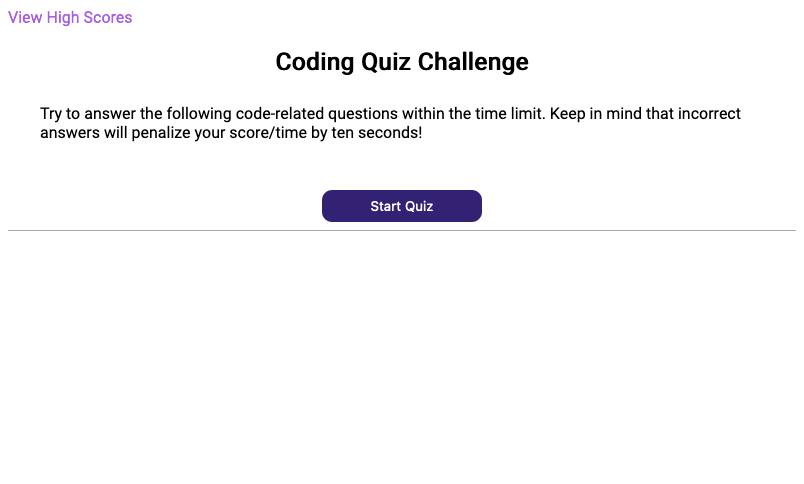
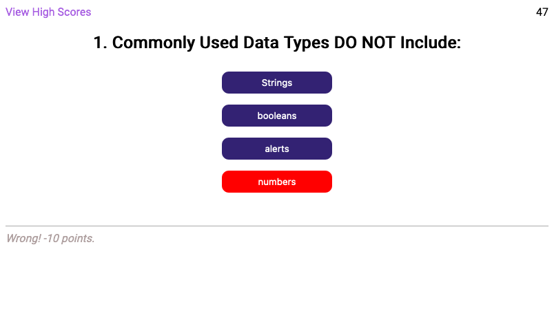
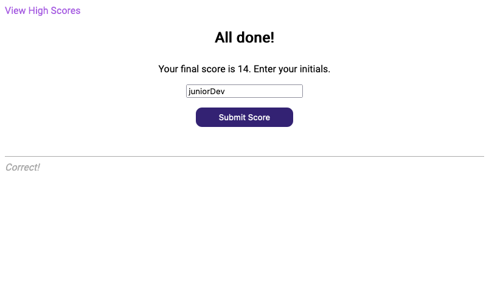

# Code Quiz

## Description

This is a short quiz to test your javascript skills! It was built to demonstrate an understanding of DOM manipulation, localStorage usage, intervals, and arrays. Test your knowledge by clicking the deployed site URL below!

Built with: Vanilla JS, HTML, CSS.

## Screenshots

## Deployed Site

[http://harmoniacodes.github.io/Code-Quiz](http://harmoniacodes.github.io/Code-Quiz)
